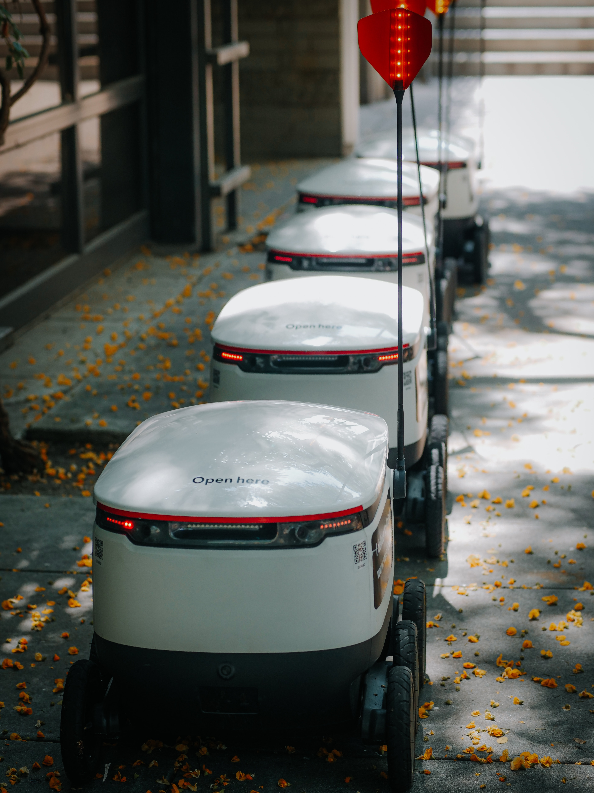

# titulo de pruba para la página

### Published on: 2022-07-01 by Gino ciancia

Lorem ipsum dolor sit amet, consectetur adipiscing elit. Morbi at dolor sit amet urna porttitor gravida. In tincidunt vel leo ac ullamcorper. Donec a consequat mauris, nec condimentum mi. Sed vehicula lobortis sem, eu gravida metus tempor a. Integer a mauris ac velit varius lacinia a non enim. Morbi semper fringilla accumsan. Donec libero lectus, eleifend in iaculis vel, volutpat id urna. Cras laoreet diam ac lectus tristique, volutpat commodo nibh fringilla. Vivamus ullamcorper orci non placerat rhoncus.

Phasellus in velit quam. Suspendisse sagittis felis nunc, eu faucibus risus finibus ut. Nam volutpat consectetur nisl, vitae sollicitudin sem eleifend eu. Mauris at urna commodo, tristique augue eu, tincidunt erat. Suspendisse ut ipsum augue. Curabitur dapibus felis id luctus hendrerit. Sed sit amet imperdiet mi. Cras in consectetur metus, eu ullamcorper est.

Praesent convallis volutpat nisi, eu hendrerit mauris. Quisque condimentum, justo sed aliquam faucibus, libero magna bibendum sem, nec fringilla ipsum tortor ut neque. Maecenas convallis a quam id elementum. Etiam at lacus tempor, commodo lectus a, dictum nunc. Duis rutrum cursus varius. Duis in condimentum magna. Pellentesque at molestie turpis, condimentum tristique risus. Mauris commodo aliquet velit, a sollicitudin ipsum placerat ac. Suspendisse nec auctor mi. Quisque urna libero, convallis ut dapibus vestibulum, venenatis ac sem. Duis a purus enim. Quisque placerat nibh sagittis leo rutrum, a pulvinar lacus vehicula.

Sed quam nunc, accumsan non tellus ut, iaculis imperdiet libero. Nulla et neque elementum eros ultricies tincidunt at vel odio. Vestibulum lobortis ullamcorper nibh, eget hendrerit turpis tincidunt eu. Sed quam elit, tincidunt ac hendrerit sed, dictum a lectus. Donec feugiat non massa nec sodales. Quisque vel dolor pharetra, hendrerit tellus at, dignissim massa. Morbi accumsan faucibus tortor, quis venenatis urna tempus sed. Sed in elementum lorem. Mauris auctor tincidunt nisi, fermentum finibus erat tincidunt eget. Praesent tempus, purus eget lobortis dignissim, justo quam dictum mauris, quis rutrum magna lorem sit amet dui. Praesent pharetra nulla nunc, vitae eleifend dolor lobortis varius. Curabitur semper justo ligula, id iaculis justo consectetur sit amet. Fusce finibus, ligula vitae finibus imperdiet, velit nulla mollis enim, eget porttitor lorem est a nunc.

Duis a velit tempor, tincidunt lorem vitae, fermentum ligula. Nulla facilisi. Etiam velit velit, euismod eu ligula quis, ornare placerat ante. Mauris eget lorem metus. Pellentesque lobortis consequat ante at cursus. Donec et mauris egestas, tincidunt nunc nec, dignissim nunc. Fusce ut maximus est, et pulvinar nulla. Lorem ipsum dolor sit amet, consectetur adipiscing elit. Aenean at fermentum ligula, vel euismod dui.

Donec semper libero eu eros aliquam, eu laoreet nibh rhoncus. Duis vulputate, risus nec lobortis auctor, metus sapien auctor tellus, ut consectetur lectus elit id mi. Fusce auctor vehicula lorem, sit amet iaculis urna viverra at. Nam placerat, dolor eget sagittis euismod, lectus tortor fringilla metus, vitae suscipit leo tellus a quam. Curabitur nec felis vulputate, venenatis quam non, faucibus enim. Nam interdum nisi in nulla molestie euismod. Nam bibendum, mi vitae varius rhoncus, tellus magna condimentum lectus, ac tempus est urna ac quam. Praesent auctor mattis ipsum, sit amet varius tellus euismod vel.

Ut ultrices vehicula nunc, ac pellentesque leo placerat at. Praesent aliquet quis sapien et imperdiet. Vivamus ut cursus dui. Pellentesque habitant morbi tristique senectus et netus et malesuada fames ac turpis egestas. Cras orci arcu, fringilla sed mi lacinia, egestas semper purus. Fusce at turpis et diam fringilla consequat vel id est. Cras eu feugiat nunc. Pellentesque sed sapien ac nulla faucibus rhoncus. Suspendisse laoreet nulla justo, nec iaculis libero tempor in. Aliquam faucibus, arcu vitae elementum elementum, erat lorem lacinia metus, nec eleifend dolor diam vel justo. Ut euismod tincidunt pulvinar. Mauris in lectus rutrum diam rutrum maximus. Pellentesque sodales vestibulum diam, vitae sodales nunc blandit eu. Donec auctor tempus nisl, eget hendrerit tortor sagittis sit amet. Mauris ac tellus leo.

In id sapien molestie, facilisis diam quis, faucibus tellus. Curabitur consequat, orci at suscipit ullamcorper, velit mauris tincidunt arcu, consectetur scelerisque dui dui sed turpis. Donec id quam dignissim nisi fringilla blandit euismod sed lectus. Ut interdum ante sit amet ipsum commodo volutpat. Curabitur blandit posuere turpis vitae porttitor. Duis pharetra vitae justo et vehicula. Mauris pellentesque iaculis mi et egestas. Nam vel erat ac mauris aliquam egestas eu nec ipsum. Phasellus tristique quam est. Ut molestie, nibh eget ultricies tristique, tellus lectus malesuada nulla, id commodo risus ante sit amet nibh. Aliquam non libero lectus. Nullam turpis orci, ornare id ipsum ac, mollis malesuada sem. Proin tristique aliquam risus at laoreet.

Curabitur tempus aliquet dictum. Cras in sagittis ligula, consectetur maximus sem. Aenean condimentum consequat est, sed mollis dolor blandit et. Donec pellentesque nulla a neque fringilla, at congue libero cursus. Proin in lorem orci. Nulla placerat nunc quis gravida faucibus. Mauris eu ultrices turpis. In id sollicitudin diam, id vulputate quam. Duis molestie odio vitae elementum iaculis. Sed vitae velit porttitor, elementum neque a, luctus justo. Praesent aliquet ut erat a lacinia. Sed ut ipsum ac est elementum volutpat. Pellentesque aliquet tempus lorem eget elementum. Suspendisse potenti. Donec tincidunt gravida consequat.
After a successful first week learning Astro, I decided to try some more. I wrote and imported a small component from memory!